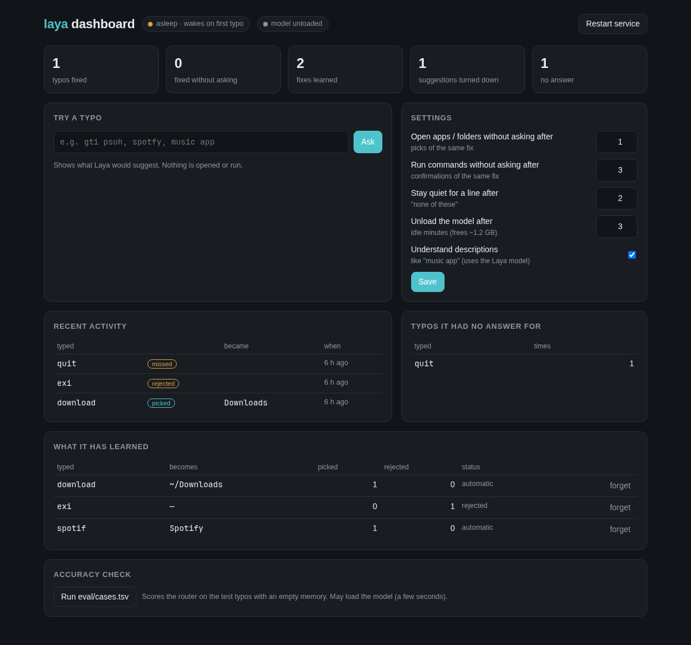

# laya-router

[](https://github.com/boss2236/laya-router/actions/workflows/check.yml)
[](LICENSE)

Mistype something in the terminal and it opens or runs what you meant:

```
❯ spotfy                    → opens Spotify
❯ cd projcts                → cd ~/Projects
❯ gti psuh                  → menu: git push / …   (↑↓ Enter, Esc cancels)
❯ music app                 → menu: Spotify / Spotube
```

It hooks bash's `command_not_found_handle`, so it only ever sees lines bash could not run.

## Install

```
curl -fsSL https://raw.githubusercontent.com/boss2236/laya-router/master/install.sh | bash
```

Needs bash, systemd (user services), python3 and git; installs [uv](https://docs.astral.sh/uv/) if missing.
It clones to `~/.local/share/laya-router` (override with `LAYA_HOME=...`), or reuses an existing install's
checkout. From a checkout: `./install.sh`. Remove: `laya uninstall`.

## Use

```
laya dashboard        what it fixed, learned and missed; try typos; settings; accuracy check
laya status           running? memory? model loaded?
laya try gti psuh     what would happen (nothing is run)
laya learned          learned fixes          laya forget <typo>
laya config auto_run=2 meaning=false
laya update           git pull + reinstall   laya uninstall
```



The dashboard is also in your app launcher as **Laya Dashboard**. It listens on 127.0.0.1 only, needs the
random token in its URL for every call, and stops by itself 10 minutes after you close it.

## How it decides

| Step | What | Why |
|---|---|---|
| Spelling | edit distance (OSA) over desktop apps (and their initials: `yt`, `vsc`), folders (cwd, ~, Projects, zoxide), `$PATH` commands and bash builtins; swapped letters rank first | edit distance is near-perfect at spelling; the model isn't |
| Arguments | `gti psuh -f` → fixes the command *and* a misspelled subcommand (git/systemctl/docker/npm/… plus whatever your bash history uses) | |
| Meaning | "web browser", "text editor": a shortlist of apps whose own description matches, ranked by the [Laya](https://huggingface.co/convaiinnovations/laya) decision model | the model is good at meaning, bad at letters |
| Learning | every pick / "none of these" goes to `~/.local/state/laya-router/picks.json` | stops asking once it knows |

When it acts without asking:

- an app or folder with one clear spelling match, or one you picked before for that exact line;
- a command only after you've confirmed the same fix **3 times**;
- "none of these" twice for a line (more often than you picked something) → it stays quiet for that line.

## Layout

```
server.py          the router (systemd socket-activated, exits after 15 min idle)
learn.py           picks.json: read by the server, written by the client
client/laya-fix    arrow-key menu, run from command_not_found_handle
client/laya        the `laya` command
dashboard/         dashboard.py (local web server) + index.html
shell/laya.bash    the bash hook (+ pay-respects `f` as fallback)
systemd/           laya-router.socket / .service
eval/              cases.tsv + run.py: the accuracy check
tests/             model-free checks (CI)
```

`install.sh` symlinks all of it into place (`~/.local/bin`, `~/.config/bash`, `~/.config/systemd/user`),
so editing this checkout edits the live setup. After changing `server.py`: `laya restart`.
Settings live in `~/.config/laya-router/config.json`; what it learned and its log in `~/.local/state/laya-router/`.

## Resources

The model is only loaded for a "meaning" question and dropped again after 3 idle minutes, in bf16.
Spelling-only use keeps the service at ~15–25 MB; with the model loaded it's ~1.2 GB.

## Checking accuracy

```
.venv/bin/python eval/run.py -v
```

Runs every line in `eval/cases.tsv` against an empty picks file. Add a line whenever it gets something wrong.
`python tests/test_basics.py` runs the model-free checks that CI runs on every push.

## Contributing and security

See [CONTRIBUTING.md](CONTRIBUTING.md). Found a security problem? Please report it privately: [SECURITY.md](SECURITY.md).

## License

[AGPL-3.0-or-later](LICENSE). The Laya model is downloaded from Hugging Face at install time under its own license.
